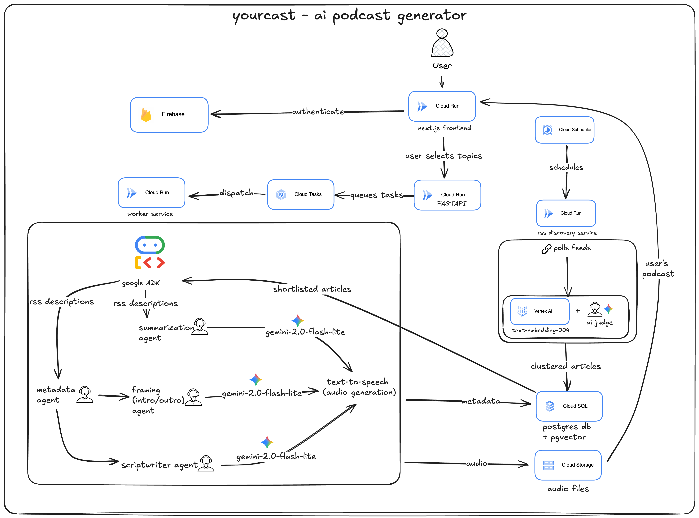

# yourcast! - AI-Powered Personalized News Podcasts

**Built for Google Cloud Run Hackathon 2025**

yourcast! generates personalized 5-minute news podcasts tailored to your interests using Google's Agent Development Kit (ADK), Gemini 2.0 Flash Lite, Gemini TTS and Cloud Run infrastructure.

## Problem

In today's information overload, staying informed across diverse interests (tech, sports, world news, business) means:
- Flipping through 10-15 news sites daily
- Dealing with clickbait and noise
- Spending 30+ minutes to stay updated
- Missing important stories in topics you care about

## Solution

yourcast! delivers a personalized audio news briefing in exactly 5 minutes:
- **Select your topics** once (Technology, Sports, World News etc, or even define your own custom topics!)
- **AI generates your podcast** - multi-agent system writes scripts from latest news
- **Listen on-the-go** - skip between topics, adjust speed, see sources
- **Always fresh** - RSS discovery runs every 6 hours, finding stories you haven't heard

---

## 🏗️ Architecture



### How It Works

#### 1. **RSS Discovery Pipeline** (Automated, Every 6 Hours)
- **Cloud Scheduler** triggers RSS discovery service
- Fetches articles from 200+ RSS feeds across categories
- **Vector Embeddings**: Converts articles to 768-dimensional vectors using `text-embedding-004`
- **Similarity Clustering**: Groups similar articles (threshold >0.85)
- **AI Judge**: Gemini 2.0 Flash Lite determines if articles cover the same event
- **Importance Scoring**: Assigns 0-100 score based on surprise factor, prominence, magnitude
- **Stores** deduplicated articles in Cloud SQL with pgvector extension

#### 2. **Smart Article Selection**
When user requests a podcast:
- **Proportional Allocation**: Topics with more articles get more coverage time
- **Time Decay**: Breaking news (World News) prioritizes recent stories; evergreen content (Science) decays slower
- **Coverage Boosting**: Widely-reported stories (multiple sources) ranked higher
- **Freshness Filter**: Only articles from last 5 days
- **Cluster Tracking**: Excludes stories user has already heard

#### 3. **Multi-Agent Podcast Generation** (Google ADK)
Sequential + Parallel execution using Google Agent Development Kit:

**Phase 1: Sequential Setup Agents**
1. **MetadataAgent** - Analyzes top stories → generates title + tone
2. **SummarizerAgent** - Creates episode description
3. **FramingAgent** - Writes intro/outro based on tone

**Phase 2: Parallel Topic Agents**
4. **TopicScriptAgents** - One per topic, runs in parallel
   - Each gets proportional word budget based on article count
   - 85-105% word count enforcement for consistent length
   - Example: 5 articles → 375 words, 3 articles → 225 words

All agents use **Gemini 2.0 Flash Lite** with strict grounding rules.

#### 4. **Audio Generation**
- **Text-to-Speech**: Parallel processing with 8 workers
- **Assembly**: Combines intro + topic scripts + outro with timestamps
- **Storage**: Uploads to Cloud Storage, returns signed URL (1-hour expiration)

---

## 🚀 Tech Stack

### Frontend
- **Next.js 14** - App Router, Server Components
- **React** - Client-side interactivity
- **Tailwind CSS** - Styling
- **Firebase Auth** - Google Sign-In
- **Firebase App Check** - Client verification
- **reCAPTCHA Enterprise** - Bot protection

### Backend
- **Python 3.11** - Worker services
- **FastAPI** - API endpoints
- **Google ADK** - Multi-agent orchestration
- **Gemini 2.0 Flash Lite** - LLM for all agents
- **Vertex AI** - Embeddings + TTS

### Infrastructure (All Google Cloud)
- **Cloud Run** - 3 services (web, api, worker)
  - Concurrency: 3 (1 for RSS, 2 for podcasts)
  - Timeout: 900s (worker), 300s (others)
- **Cloud SQL** - PostgreSQL 15 + pgvector extension
- **Cloud Storage** - Audio file hosting
- **Cloud Tasks** - Async job queue
- **Cloud Scheduler** - RSS discovery trigger

### Database
- **PostgreSQL 15** with **pgvector** for semantic search
- Tables: users, episodes, sources, articles, story_clusters

---

## 🎨 Key Features

### User Features
- **Google Sign-In** - Secure authentication
- **Topic Selection** - Choose from 9 categories, 50+ subcategories
- **Custom Topics** - Add specific interests via tag search
- **One-Click Generation** - Generate personalized podcast in ~2 minutes
- **Audio Player** - Skip forward/backward, playback speed, volume
- **Chapter Timestamps** - Jump directly to topic categories
- **Source Attribution** - View all news sources cited
- **Episode Archive** - Access your previous 5 podcasts

### Backend Intelligence

**Smart Article Selection**
```python
# Proportional word allocation
topic_words = (articles_in_topic / total_articles) * 600

# Time decay formula
score = importance * exp(-age_hours * decay_rate)

**Multi-Agent Coordination**
- Sequential setup (metadata → description → framing)
- Parallel topic generation (all topics simultaneously)
- 85-105% word budget enforcement
- Per-article guidance for intelligent distribution

---

## 📊 Configuration System

Centralized YAML-based configuration:
- `config/algorithms.yaml` - Time decay rates, scoring thresholds
- `config/limits.yaml` - Rate limits, timeouts, selection limits
- `config/endpoints.yaml` - API URLs for all services
- `config/services.yaml` - Service endpoints
- `config/infrastructure.yaml` - Cloud resource settings

Environment-specific overrides in `config/environments/`.

---

## 🔐 Security

- **Firebase Authentication** - Google OAuth 2.0
- **Firebase App Check** - Prevents unauthorized clients
- **reCAPTCHA Enterprise** - Bot detection
- **CORS Configuration** - Restricts API access
- **Signed URLs** - Time-limited audio access (1 hour)
- **Environment Variables** - Secrets managed via Cloud Secret Manager

---

## 📁 Project Structure

```
yourcast/
├── apps/
│   ├── api/              # FastAPI backend
│   │   ├── app/
│   │   │   ├── api/      # Endpoints
│   │   │   ├── models/   # SQLAlchemy models
│   │   │   ├── services/ # Business logic
│   │   │   └── middleware/
│   │   └── Dockerfile
│   └── web/              # Next.js frontend
│       ├── src/
│       │   ├── app/      # Pages & API routes
│       │   ├── components/
│       │   └── contexts/
│       └── Dockerfile
├── workers/
│   └── agent/            # Worker service
│       ├── agent/
│       │   ├── adk_agents.py     # Google ADK agents
│       │   ├── services/         # RSS, LLM, TTS, etc.
│       │   └── pipeline/         # Podcast generation
│       └── http_worker.py
├── config/               # YAML configuration
├── database/             # SQL schemas
├── shared/               # Shared Python config
└── cloudbuild.yaml       # CI/CD for Cloud Build
```

---

## 🎯 Google Cloud Run Hackathon Integration

### Cloud Run Services (3 Total)
1. **yourcast-web** - Next.js frontend
   - Concurrency: 80
   - Min instances: 1
   - Timeout: 300s

2. **yourcast-api** - FastAPI backend
   - Concurrency: 10
   - Min instances: 0
   - Timeout: 300s

3. **yourcast-worker** - Podcast generation
   - Concurrency: 3 (1 for RSS, 2 for podcasts)
   - Min instances: 1
   - Timeout: 900s (15 minutes)

### Google ADK (Agent Development Kit)
- **4 specialized agents** orchestrated with SequentialAgent + ParallelAgent
- **Session state management** for agent communication
- **Asynchronous execution** with streaming events
- **Vertex AI integration** via `genai` client

### Other Google Cloud Services
- **Cloud SQL** - Managed PostgreSQL
- **Cloud Tasks** - Async job queue
- **Cloud Scheduler** - Cron jobs
- **Cloud Storage** - Audio file hosting
- **Vertex AI** - Embeddings, LLM, TTS
- **Cloud Build** - CI/CD pipeline

---

## 🚀 Deployment

### Prerequisites
- Google Cloud Project with billing enabled
- Cloud SQL PostgreSQL instance with pgvector
- Firebase project with Google Auth enabled
- Service account with appropriate permissions

### Deploy to Cloud Run
```bash
# Build and deploy all services
gcloud builds submit --config=cloudbuild.yaml \
  --project=YOUR_PROJECT_ID \
  --substitutions=SHORT_SHA=v1
```

### Environment Variables
Set these via Cloud Run UI or Secret Manager:
- `DATABASE_URL` - Cloud SQL connection string
- `GOOGLE_CLOUD_PROJECT` - GCP project ID
- `FIREBASE_PROJECT_ID` - Firebase project ID
- `WORKER_URL` - Worker service URL
- `NEXT_PUBLIC_API_URL` - API endpoint for frontend

---

## 📈 Performance

- **Podcast Generation**: ~2 minutes (8 articles, 4 topics)
- **RSS Discovery**: ~15-30 minutes (200+ feeds, 1000++ articles)
- **Database Queries**: <100ms (pgvector similarity search)
- **LLM Latency**: ~2-5s per agent (Gemini 2.0 Flash Lite)
- **TTS Generation**: ~15s (parallel processing)

### Scalability
- **Horizontal scaling** via Cloud Run autoscaling
- **Concurrency control** prevents resource exhaustion
- **Database connection pooling** for efficiency
- **Async job processing** via Cloud Tasks

---

## 🔮 Future Enhancements

- **Voice cloning** for personalized narration
- **Multi-language support** (Spanish, French, etc.)
- **Mobile apps** (iOS/Android)
- **Podcast feeds** via RSS for podcast apps
- **Social sharing** with generated clips
- **Analytics dashboard** for listening patterns

---

## 📄 License

MIT License - See LICENSE file for details

---

## 🙏 Acknowledgments

- **Google Cloud Run Hackathon 2025**
- **Google Agent Development Kit (ADK)** team
- **Gemini 2.0 Flash Lite** for fast, accurate LLM responses
- **Vertex AI** for embeddings and TTS
- **Firebase** for authentication infrastructure

---

## 📞 Contact

Built by [@rohanz](https://github.com/rohanz) for the Google Cloud Run Hackathon 2025.

**Demo**: [yourcast.app](https://yourcast-web-zprpg5fm2a-uc.a.run.app/)
**Video**: [YouTube Demo](https://www.youtube.com/watch?v=EEBPhfFPzTY)

---


